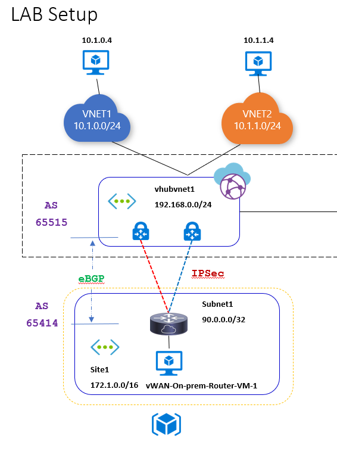

# Deploy Virtual WAN with Remote Office integration

## Purpose

Azure Virtual WAN is an ever evolving network technology with amazing automation/orchestration built-in. This deployment allows one to simulate BGP peering and advertisements.


## PowerShell Deployment

The steps outlined assumes the deployment is occurring from a workstation configured with Bicep and PowerShell. Other deployment options include Azure CloudShell via CLI or PowerShell which are not covered below. Update the parameters file before deploying.

Example 1: Deploy to Azure Commercial

```powershell
PS C:\repos\vWAN-Lab\IaC> .\deployBicep.ps1
```
